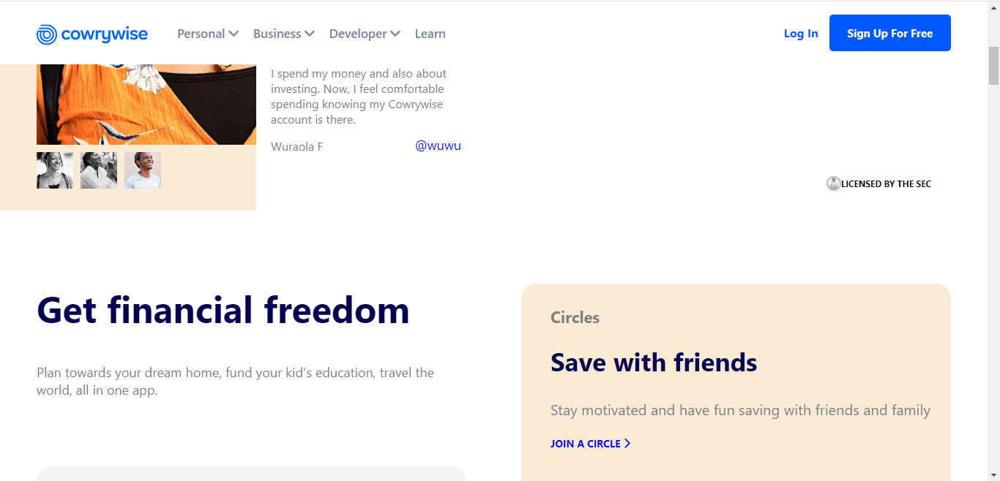

# Cowrywise HomePage :star2:

Fully Responsive Cowrywise HomePage built with Html and Css. It can be viewed on Desktop and Mobile Phones.

The link to the HomePage is [Here](http://babzt.github.io/Cowrywise/).

Star:star: the Repo if you like what you see:blush:.

## Requirements :hammer_and_wrench: 

- Any Operating System (ie. MacOS X, Linux, Windows)
- Knowledge of Html and Css.
- Tool: Visual Studio Code.

 ## Screenshots :camera_flash:
 
  
  
  
  
 
 

## Author(s):sunglasses:
##### Akinwobi Babatunde Hezekiah

